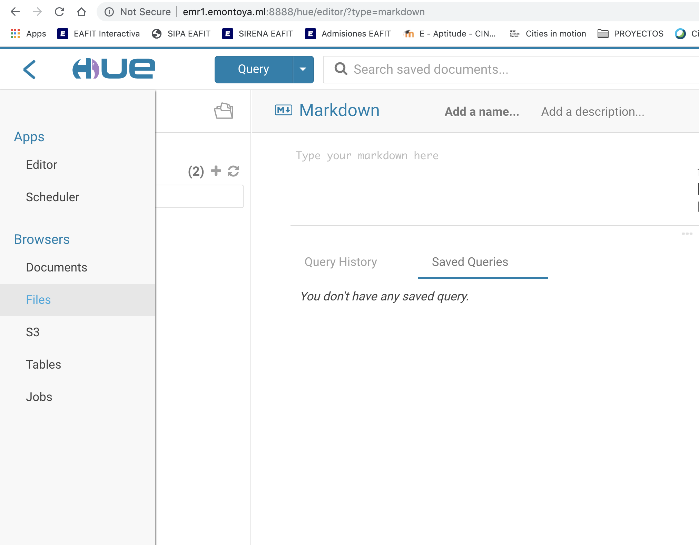
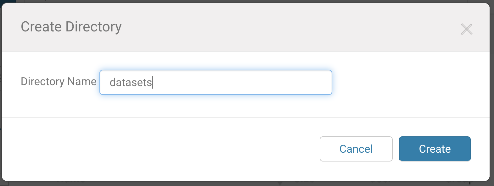
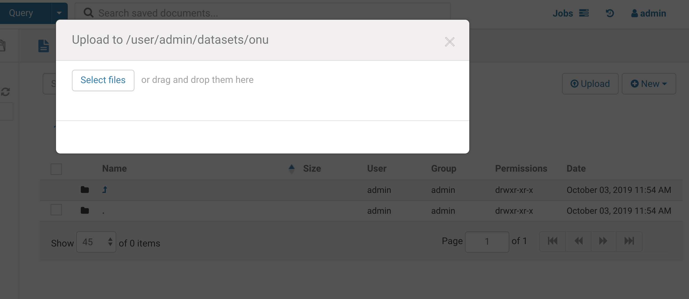
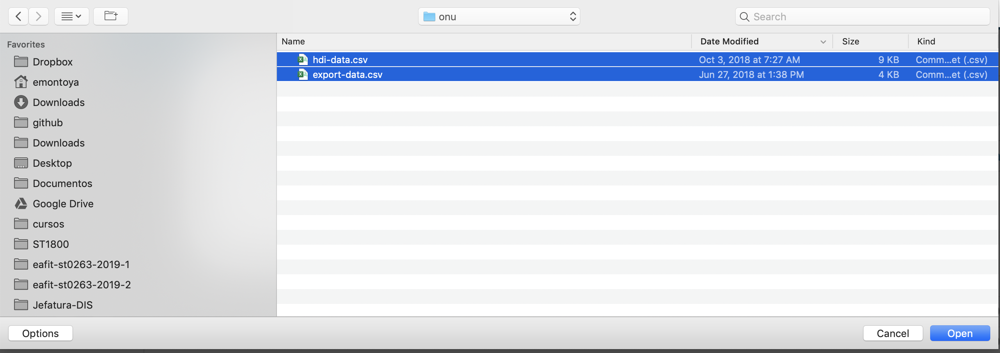
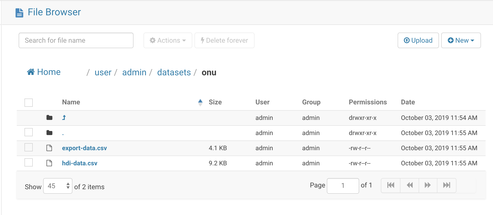
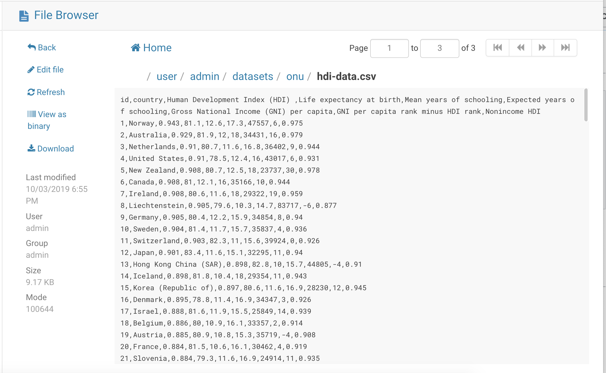

# Curso CEC Big Data TI 2020 - feb-mar-2020
## Por: Edwin Montoya, Universidad EAFIT, Medellín-Colombia
## emontoya@eafit.edu.co

# Laboratorio HDFS

## 1 CONECTARSE AL CLUSTER AMAZON EMR:

## Por Terminal:

        $ ssh -i ~/bigdatati.pem hadoop@hostname.compute-1.amazonaws.com
        $ sudo su

## 2. GESTIÓN DE ARCHIVOS EN HDFS VÍA TERMINAL

1. Cargar los datos de los datasets de trabajo del tutorial en HDFS 
2. Cada participante creara en hdfs un directorio 'datasets' en su 'home' (/user/hadoop)
3. En 'datasets' los archivos ya deben estar descomprimidos para ser procesables.
4. Datasets: [datasets](../datasets)

### Listar archivos HDFS

Para efectos de esta guia, es equivalente el comando "hadoop fs" y "hdfs dfs". La diferencia es que "hdfs dfs" es solo para sistemas de archivos HDFS, pero "hadoop fs" soporta otros adicionales como Amazon S3.

    user@master$ hdfs dfs -ls /
    user@master$ hdfs dfs -ls /user
    user@master$ hdfs dfs -ls /user/hadoop
    user@master$ hdfs dfs -ls /datasets

### Crear tu propio directorio de 'datasets' en HDFS

    user@master$ hdfs dfs -mkdir /user/hadoop/datasets

Nota: reemplace 'hadoop' por aca usuario asignado

### Copiar archivos locales (al servidor gateway) hacia HDFS

Se asume que tiene los datos LOCALES se encuentran en /datasets en el gateway
También están en este github, y por terminal debería copiarlos por SSH/SCP al servidor Gateway por la VPN.
También están en Amazon S3:      s3://emontoyapublic/datasets

    user@master$ hdfs dfs -mkdir /user/hadoop/datasets
    user@master$ hdfs dfs -mkdir /user/hadoop/datasets/gutenberg-small

* archivos locales FS en el emr-master:

    user@master$ hdfs dfs -put /datasets/gutenberg/gutenberg-small.zip /user/hadoop/datasets/

* archivos en Amazon s3:

    user@master$ hadoop distcp s3://emontoyapublic/datasets/airlines.csv /tmp/

    user@master$ hadoop distcp /user/hadoop/retail_db/* s3://emontoyapublic/retail_db/

* copia recursiva de datos
    
    user@master$ hdfs dfs -copyFromLocal /datasets/* /user/hadoop/datasets/

listar archivos: 

    user@master$ hdfs dfs -ls /user/hadoop/datasets
    user@master$ hdfs dfs -ls /user/hadoop/datasets/gutenberg-small/

### **Copiar archivos de HDFS hacia el servidor local (gateway)

    user@master$ hdfs dfs -get /user/hadoop/datasets/gutenberg-small/* ~hadoop/mis_datasets/    (el directorio 'mis_datasets' debe estar creado)

otro comando para traer:

    user@master$ hdfs dfs -copyToLocal /user/hadoop/datasets/gutenberg/gutenberg-small.zip ~hadoop/mis_datasets/

    user@master$ ls -l mis_datasets

### Probar otros commandos

Se aplica los siguientes comandos a:

    user@master$ hdfs dfs -<command>

comandos:

    du <path>             uso de disco en bytes
    mv <src> <dest>       mover archive(s)
    cp <src> <dest>       copiar archivo(s)
    rm <path>             borrar archive(s)
    put <localSrc> <dest-hdfs> copiar local a hdfs
    cat <file-name>       mostrar contenido de archivo
    chmod [-R] mode       cambiar los permisos de un archivo
    chown hadoop files   cambiar el dueño de un archivo
    chgrp <group> files      cambiar el grupo de un archivo

# 3. GESTIÓN DE ARCHIVOS VÍA HUE

## ** Login

## ** Explorar archivos

## ** Crear un directorio

## ** Subir (upload) archivos

## ** Ver contenido de un archivo

